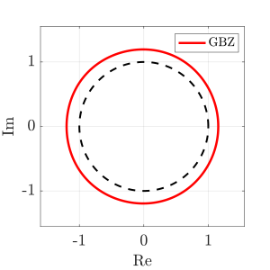
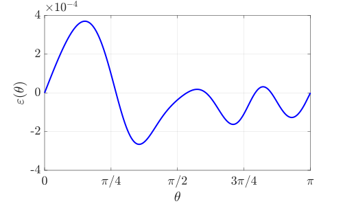
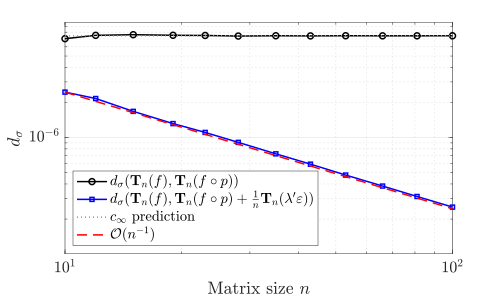

<h1 align="center">Spectral convergence of the generalised Brillouin zone</h1>

  <b>Y. DE BRUIJN</b> and <b>E. O. HILTUNEN</b> 
  <i>University of Oslo</i> 

  

**Abstract:** We provide the complete computational framework supporting the theoretical results in [1].

  Last updated: August 23, 2026

**Run File** (`Runfiles.m`)  

   
  <em>Figure 1: caption here</em>

   
  <em>Figure 2: caption here</em>

   
  <em>Figure 3: caption here</em>

## IV. References

> [1]
> 
## Citation

If you use this code in your research, please cite:

> De Bruijn, Y. and Hiltunen, E.O., *Spectral convergence of the generalised Brillouin zone* (2026)
