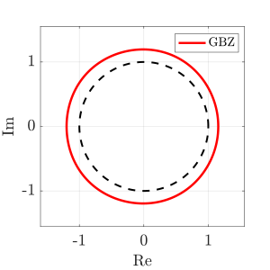
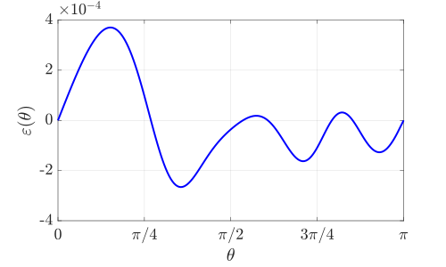
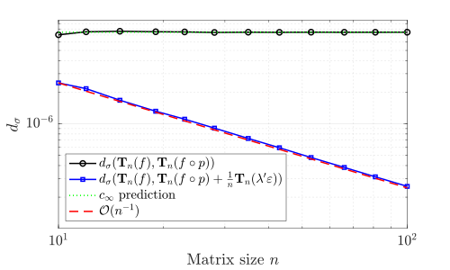

<h1 align="center">Spectral convergence of the generalised Brillouin zone</h1>
<p align="center">
  <b>Y. DE BRUIJN</b> and <b>E. O. HILTUNEN</b><br>
  <sub><i>University of Oslo</i></sub><br>
</p>
<p align="center">
  
</p>

**Abstract:** Computational framework supporting the theoretical results of [1]: the generalised Brillouin zone (GBZ) of an $m$-banded non-Hermitian Toeplitz matrix, the first-order phase correction of its parametrisation, and the resulting spectral convergence.

<sub>Last updated: October 9, 2026</sub>

## I. First- and second-order corrections

The script `Runfiles.m` builds an $m$-banded non-Hermitian Toeplitz matrix with algebraically decaying off-diagonals, computes its GBZ and the first-order phase correction of [1, Section 3], and compares the spectra of the original and the symmetrised matrices. The figures below are produced with

```matlab
Show_the_GBZ     = true;
Show_phase_shift = true;
```

<p align="center">
  <br>
  <em>Figure 1: Generalised Brillouin zone p(𝕋) compared with the unit circle.</em>
</p>

<p align="center">
  <br>
  <em>Figure 2: Phase mismatch ΔΨ defining the first-order correction.</em>
</p>

<p align="center">
  <br>
  <em>Figure 3: Spectral distance d_σ between the original and the corrected symmetrised matrix as a function of n.</em>
</p>

## II. Acknowledgments

The authors thank Michael Floater for providing `resample2.m` and `lagrangeInterp.m`, used for the spline interpolation of the generalised Brillouin zone used in `first_order_expansion.m`.

## III. References

> [1] Y. De Bruijn and E. O. Hiltunen, *Non-Bloch band theory for finite banded non-Hermitian Toeplitz matrices*, 2026.
>
> [2] Y. De Bruijn and E. O. Hiltunen, *Mathematical foundation for the generalised Brillouin zone of m-banded Toeplitz operators*, 2026.

## Citation

If you use this code in your research, please cite:

> Y. De Bruijn and E. O. Hiltunen, *Non-Bloch band theory for finite banded non-Hermitian Toeplitz matrices*, 2026.
